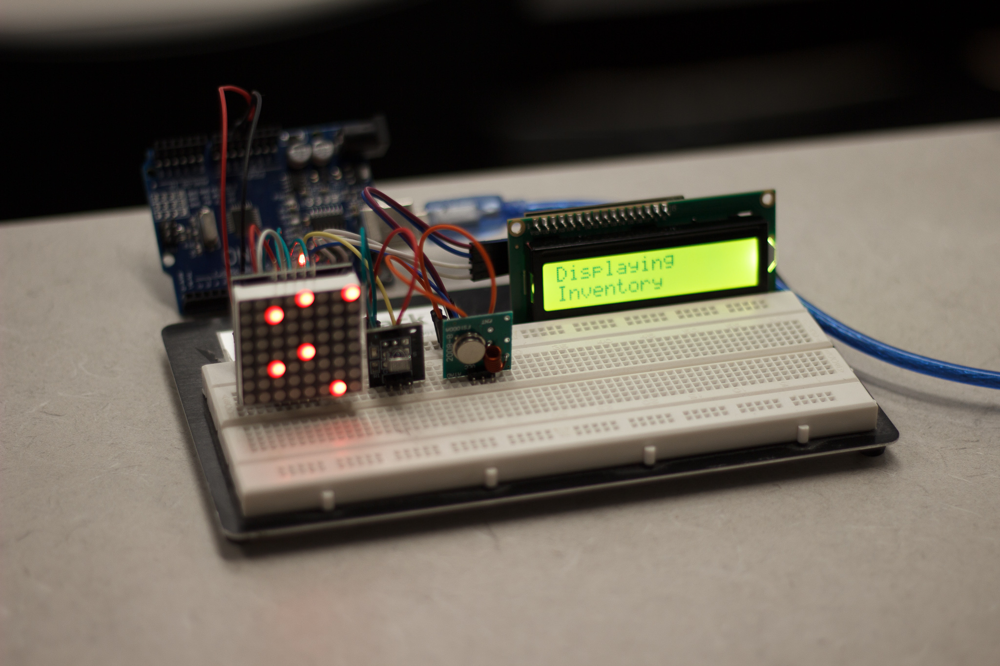
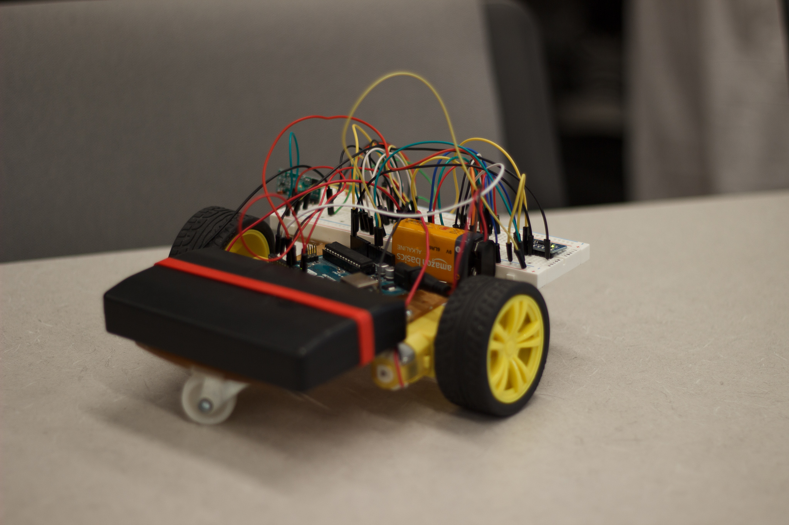

# Subspace

**Subspace** is a compact, automated storage and retrieval system designed for environments where space and efficiency are critical — such as submarines. It provides a simple interface for tracking available storage and managing inventory through a custom-built hardware controller and storage robot.

## Features
- Visual interface for inventory tracking
- Automated storage and retrieval via remote control
- Positional accuracy using a 6 DOF gyroscope/accelerometer
- Bidirectional movement control for storage robot

## Physical Components

Subspace was developed using Arduino controllers and various peripheral components:
- **Control Terminal**: Features a dot matrix LED display, LCD text screen, IR receiver with remote, and a radio transmitter for robot communication.  
- **Storage Robot**: Equipped with the **GY-521** 6 DOF gyroscope and accelerometer for real-time positional tracking and **L293D** motor drivers for bidirectional control of DC motors.

## Libraries Used
- `IRremote [4.4.1]` – Send/receive infrared signals  
- `LiquidCrystal I2C [1.1.2]` – I2C LCD display interface  
- `RadioHead [1.143.1]` – Embedded microprocessor communication  
- `LED Control` – Dot matrix LED control  

## Usage
Before operating in the field, make sure to **calibrate the GY-521** sensor to ensure accurate positional tracking.

## Devpost
View the project on Devpost:  
[https://devpost.com/software/subspace-aqulkc](https://devpost.com/software/subspace-aqulkc)
